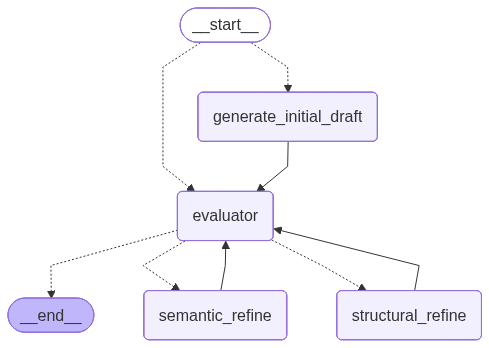

# 📘 Mini-Docs Backend — **Extensive Architectural Documentation**

## 1. Overview

Mini-Docs is a service designed to **generate, refine, evaluate, and export** professional documents (Word & PPT) using a **LangGraph agentic pipeline**.
It exposes a simple FastAPI service that orchestrates LangGraph execution **without retaining memory** (fully stateless).

Core responsibilities:

1. Generate initial draft content
2. Evaluate content → detect semantic & structural issues
3. Refine content iteratively
4. Allow user-edited content re-evaluation
5. Export finished content to `.docx` or `.pptx`

---

# 2. System Architecture

The backend architecture has three major layers:

1. **FastAPI Interface Layer**
2. **LangGraph Engine (Core Brain)**
3. **Export Engine (PPTX/DOCX generators)**

---

# 3. LangGraph Workflow (Main Crux)

The workflow is a **supervised graph** with dynamic branching.



### 3.1 Supervisor

The **supervisor node** decides whether the graph starts with:

* `"generate_initial_draft"`
  or
* `"evaluator"`

Based on:

```python
def supervisor(state: GraphState) -> GraphState:
    if state["supervisor_state"]["trigger_action"] == "generate":
        return "generate_initial_draft"
    elif state["supervisor_state"]["trigger_action"] == "evaluate":
        return "evaluator"
```

This allows:

✔ Full generation workflow
✔ Direct evaluation of an already edited document

---

# 4. Graph State Model (Global State for Every Graph Run)

Your primary state object:

```python
class GraphState(TypedDict):
    supervisor_state: SupervisorState
    user_state: UserState
    generated_state: GeneratedState
    evaluator_state: EvaluatorState
    iteration: int
    evaluator_history: List[dict] = []
```

### Why no memory?

* LangGraph is run as an isolated function call.
* Every run receives a full initial state.
* No DB or vector memory used. (To be integrated with DB)
* Ensures stateless, backend-as-a-service model.

---

# 5. Key State Sub-Models

## 5.1 Evaluator State

Evaluator is the central decision maker.

```python
class SemanticChangeConfig(BaseModel):
    section_name: str
    issue: str
    suggestion: str

class StructuralChangeConfig(BaseModel):
    action: Literal["add", "remove", "rename", "reorder"]
    section_name: str
    context: str

class EvaluatorState(BaseModel):
    coherency_score: float
    semantic_issues: Union["None", List[SemanticChangeConfig]]
    structural_changes: Union["None", List[StructuralChangeConfig]]
    next_action: Literal["semantic_refine","structural_refine","no_action"]
    evaluator_diagnostic_summary: str
```

Evaluator responsibilities:

* Score coherency
* Identify wording/logic clarity issues
* Detect structural issues: missing sections, redundant sections, reordering needs
* Decide next action
* Produce a "diagnostic summary"

### 5.1.1 `evaluator_history`

Critical when the user triggers evaluation on *already edited* content.

It stores:

```python
{
  "coherency_score": float,
  "semantic_issues": [...],
  "structural_changes": [...],
  "evaluator_diagnostic_summary": str
}
```

---

## 5.2 Generated State

```python
class GeneratedConfig(BaseModel):
    section_name: str
    content: str

class GeneratedState(BaseModel):
    generated_content: List[GeneratedConfig]
```

This is the authoritative representation of the document.
All refinements must mutate only this state.

---

# 6. Nodes in the Graph

### 6.1 generate_initial_draft node

Tasks:

1. Create document structure
2. Generate content for each section
3. Populate `GeneratedState`

Triggers:

* Initial generation request
* Regeneration triggers

### 6.2 evaluator node

Runs after:

* initial generation
* every refinement step
* direct evaluate endpoint

Checks:

* coherence
* clarity
* tone consistency
* structural correctness
* alignment with context & constraints

Based on results → sets:

```python
next_action: "semantic_refine" | "structural_refine" | "no_action"
```

### 6.3 semantic_refine node

* Fixes wording clarity, explanations
* Improves logical flow
* Adjusts tone
* Adds missing reasoning

### 6.4 structural_refine node

Handles coarse-grained edits:

* Add new section
* Remove section
* Reorder
* Rename
* Expand contextually missing portions

Iterates until evaluator returns `"no_action"` or iteration limit reached.

---

# 7. Iteration Control

MVP is coded with iteration control in mind,  a simple:

```python
iteration: int
```

with a max iteration like:

```python
if state["iteration"] >= MAX_ITER:
    evaluator_state.next_action = "no_action"
```

Prevents infinite loops and ensures predictable latency.

---

# 8. FastAPI Endpoints

Three endpoints power the entire SaaS backend.


- ## 8.1 POST `/generate`

    Triggers full graph run with the supervisor routing to `"generate_initial_draft"`.

    ### Request Model

    ```python
    class UserSectionDefinition(BaseModel):
        section_name: Optional[str]
        description: Optional[str]

    class GenerateStateInput(BaseModel):
        main_topic: str
        dynamic_generation: Optional[Literal["true","false"]] = "false"
        expected_sections_count: Optional[str] = ""
        sections: Optional[List[UserSectionDefinition]] = []
        constraints: Optional[str] = ""
        context: Optional[str] = ""
    ```

    ### Response Payload

    ```json
    {
    "generated_content": [...],
    "coherency_score": 0.87,
    "evaluator_diagnostic_summary": "Summary text..."
    }
    ```

    Each `generated_content` entry gets a unique UUID:

    ```python
    entry["id"] = str(uuid.uuid4())
    ```

    ---

- ## 8.2 POST `/evaluate`

    Used when:

    * User edits the document
    * User adds/removes/reorders sections
    * User wants quality improvements without regeneration

    Supervisor routes directly to `"evaluator"`.

    ### Request Model

    ```python
    class GeneratedSectionStructure(BaseModel):
        section_name: Optional[str]
        content: Optional[str]

    class EvalStateInput(BaseModel):
        main_topic: str
        dynamic_generation: Optional[Literal["true","false"]] = "false"
        expected_sections_count: Optional[str] = ""
        sections: Optional[List[UserSectionDefinition]] = []
        constraints: Optional[str] = ""
        context: Optional[str] = ""
        generated_content: List[GeneratedSectionStructure]
    ```

    ### Response Payload

    ```json
    {
    "generated_content": [...],
    "eval_hist_payload": [
        {
            "coherency_score": 0.92,
            "evaluator_diagnostic_summary": "Improved coherence..."
        }
    ]
    }
    ```

    ---

- ## 8.3 POST `/export`

    Exports final content to `.docx` or `.pptx`.

    ### Request

    ```python
    class Section(BaseModel):
        section_name: str
        content: str
        id: str

    class GenerateRequest(BaseModel):
        generated_content: List[Section]
        type: str  # "doc" or "ppt"
    ```

    ### Response

    StreamingResponse of PPTX or DOCX:

    ```
    Content-Disposition: attachment; filename=output.docx
    ```

    or

    ```
    Content-Disposition: attachment; filename=output.pptx
    ```

---

# 9. Export Engine (DOCX / PPTX)

## 9.1 DOCX Generation

* Uses python-docx
* Each section becomes a heading + body
* Stylistic structure is stable & easily themeable

## 9.2 PPTX Generation

* Uses python-pptx
* Each section becomes one slide
* Title = section name
* Body = content
* Optional formatting for readability

---

# 10. Flow Scenarios

## 10.1 Full Generation Flow

```
POST /generate
     ↓
supervisor → generate_initial_draft
     ↓
 evaluator → semantic_refine/structural_refine loops
     ↓
 response with generated_content
```

## 10.2 User Edits → Evaluate Flow

```
POST /evaluate
     ↓
supervisor → evaluator
     ↓
refinement loops (if needed, decided by evaluator agent)
     ↓
updated generated_content + evalutator history
```

## 10.3 Export

```
POST /export
     ↓
generate docx/pptx
     ↓
StreamingResponse
```

---

# 11. Stateless Design Philosophy

The backend is:

✔ Deterministic
✔ Stateless
✔ No memory, no vector DB
✔ Each run receives complete state
✔ Ensures horizontally scalable SaaS

This design flow is developed keeping in my that state will be derived from database eventually.

---

# 12. Future Improvement Points (For Prototype)

* Section-level caching
* Multi User
* Linking witn Database

---

# 13. Backend Folder Structure 

```
backend/
 ├── app/
 │   ├── agents/
 │   │    └── workflow.py [langgraph workflow]
 │   ├── service
 │   │    └── format_output_file.py [helper to format ppt and doc]
 │   ├── main.py  [fastapi logic]
 ├── pyproject.toml
 └── uv.lock
```

---

# 14. Summary Statement

This documentation covers the **full architecture, data flow, models, and endpoint behaviors** required for Mini-Docs MVP.
It provides the foundation for scaling into a more sophisticated multi-agent editorial engine while preserving the clean SaaS-style stateless model.

---

